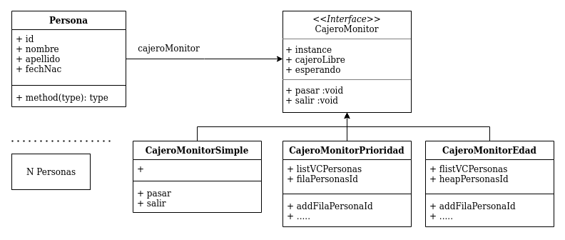
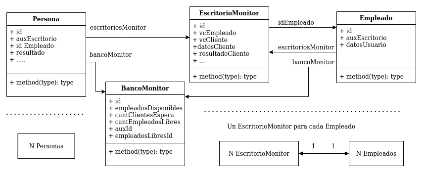

## concurrenciaMonitores
son una collección de **ejemplos prácticos y Técnicas de Programacion Concurrente** implementados con **java threads**, sincronizando procesos y recursos compartido
atravez del uso de monitores

en cada ejemplo se busca **maximizar la Cocurrencia** y **mejorar el performance** de cada programa aprovenchando los multicore del procesador

### \#1 PassingContion

##### N procesos Persona - Un Recurso Compartido

ejemplo en el que se usa la tecnica de **programacion concurrente passing the condition**, 

el ejemplo consiste en simular el acceso a un recurso compartido por **N procesos** Concurrentes Persona, el recurso compartido representa el uso de un **Cajero Automatico** que solo puede ser usado por una persona a la vez. El acceso al Recurso compartido es **Administrado y sincronizado** por una implementacion de la interface CajeroMonitor

las distintas implementaciones del monitor **cambian las reglas de acceso** al recurso

##### Diagrama UML

#### CajeroMonitorSimple
es la implementacion mas sencilla de un monitor. todos los **procesos concurrentes Persona** acceden al recurso compartido.. segun el **orden de llegada** al mismo, el monitor permite el paso inmediatamente si ningun proceso esta ocupando el recurso compartido (cajero). si el recurso se encuentra ocupado el monitor demora al proceso en una fila de espera, para que cuando el recurso sea liberado inmediatamente pueda ser accedido por el siguiente proceso Persona de la fila

#### CajeroMonitorPrioridad
al igual que el monitor simple el acceso al recurso compartido es en **orden de llegada** con la diferencia que, si llega una persona **mayor a 60 años de edad** es tomado como prioridad y este es el proximo en acceder al recurso

#### CajeroMonitorEdad
esta implementacion permite acceder al recurso compartido al **proceso concurrente persona** de mayor edad que se encuentre en la fila de espera, y en busca de mantener el mejor rendimiento posible se usa una estructura de Arbol Ordenado **TreeSet** que garantiza **el tiempo de Log(n)** para las operaciones 

### \#2 nRecursosCompartidos

##### N procesos Persona - N Recurso Compartido

Es un ejemplo donde **N Procesos Concurrentes Persona** se ejecutan como clientes esperando ser atendidos por un Banco.
en dicho Banco existen  **N Procesos Concurrentes Empleados** (recursos compartido por los clientes) quienes son encargados de procesar las solicitudes de los **clientes**,
cada empleado solo puede atender un cliente a la vez.

los clientes son atendidos segun el **Orden de llegada** al Banco, sincronizados por BancoMonitor y EscritorioMonitor

en la implementacion para ser mas descriptivo son 10 clientes procesos persona y 3 procesos empleados ejecutados sobre un pool de treadhs de 6

##### Diagrama UML

**BancoMonitor** se encarga de recibir clientes y mantenerlos en la fila( **orden de llegada** ) hasta que algun Empleado este libre y pueda atenderlo

**EscritorioMonitor** se encarga de sincronizar la interacción del cliente y empleado asignado por el banco para ser atendiddo. hasta concluir la atención y el empleado pueda atender otro

